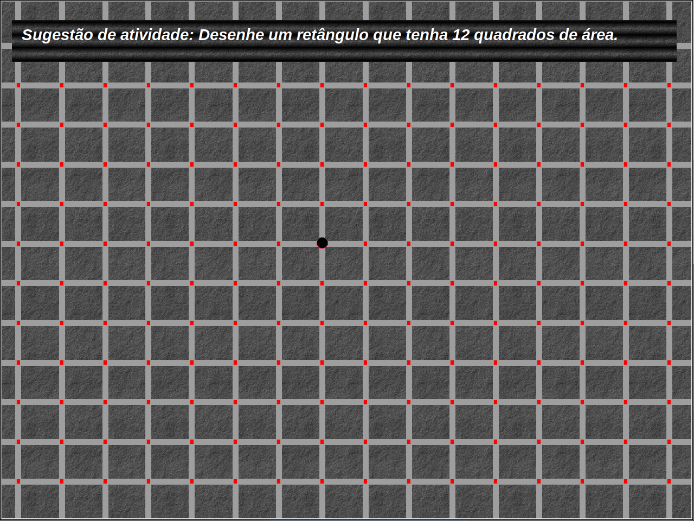

# Geoplano
Geoplano virtual com _Turtle Graphics_

#### Para movimentar a caneta utilize as setas do seu teclado: ⬅⬆⬇➡

## Como iniciar o Geoplano:
Use o `Python 3` para rodar o `geoplano.py`

* Depende do `tkinter`:
  * Caso não tenha instalado, rode `pip install tk`
  * No Linux, talvez necessite do pacote `python3-tk`
  
## A fazer:

* [x] Iniciar com a caneta em um ponto do Geoplano.
* [x] Adicionar `sugestão de atividade`.
* [x] Adicionar movimentação pelo teclado.
* [ ] Criar botões para voltar e avançar movimentos.
* [ ] Permitir movimentar a caneta sem desenhar. (barra de espaço?)
